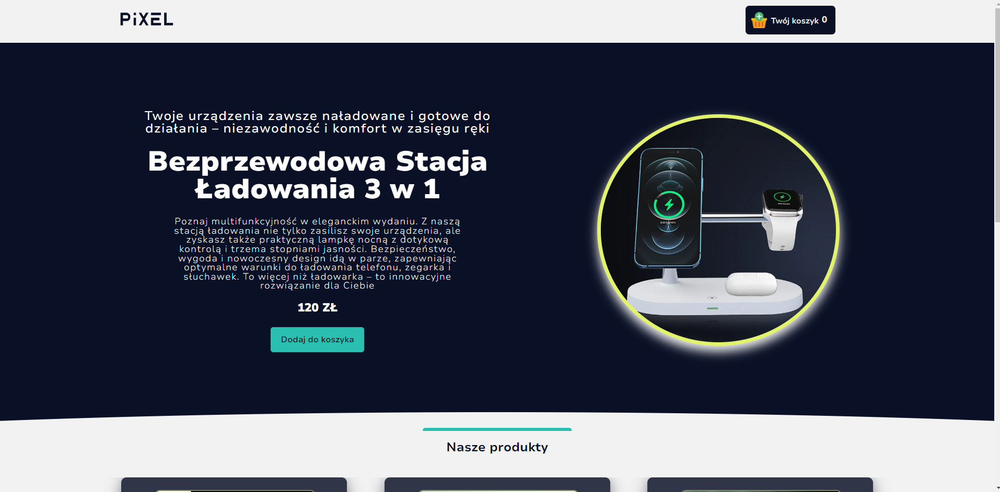
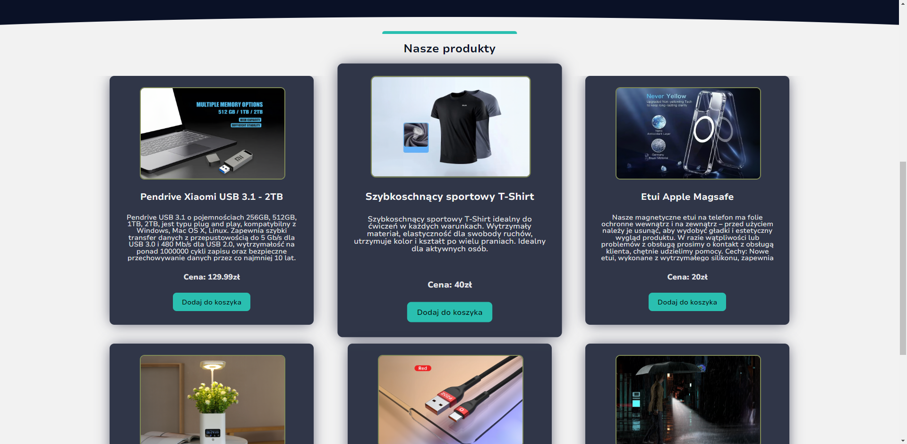
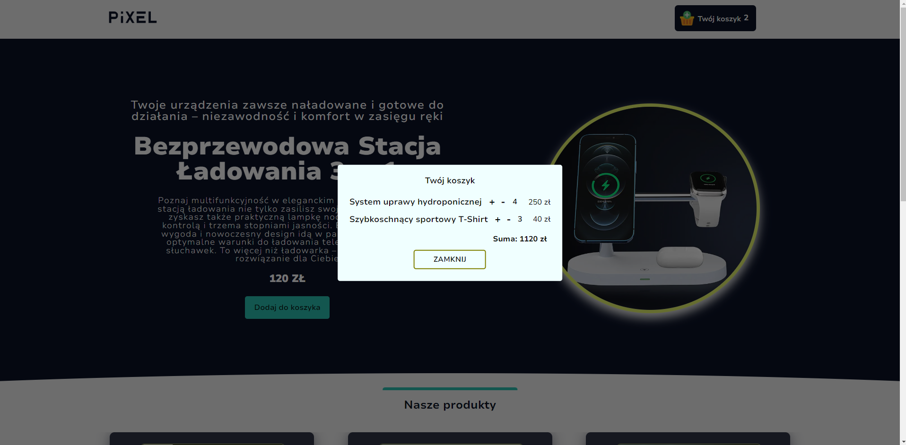

# Mini Online Store with Cart and Product Editing

## Brief Description

An online store application built using React. It renders products from a "mock" database, simulated using a JS file containing an array of objects representing individual products. The application allows adding products to the cart (which displays the quantity based on the array length to show unique quantities). Through the cart (which is a modal created using portals), you can add or remove products (increase their quantity or decrease it, automatically removing them when decreasing from 1 to 0). The cart also displays the total amount for the products, considering their quantity and price (rounded to two decimal places). The application is not responsive. It was created for the purpose of learning concepts in React.

## Technologies

- React
- React Context
- SCSS (Modules)
- PropTypes
- React hooks (useState, useContext, useRef, useImperativeHandle)
- ReactDOM (ReactDOM.createPortal)

## Features

- **Animations**: The app has introduced subtle animations to improve the experience of using the site.
- **Product Management**: You can add or remove products from the cart, as well as increase or decrease their quantity.
- **Dynamic Cart**: The cart dynamically updates the total amount and quantity of the products.

Components use React Context to manage the shopping cart state, allowing for adding products to the cart, removing them, and viewing the cart's contents. Components styling is managed through SCSS modules.

## App Screenshots

### Home Page with Main Product

### Product List

### Cart with Products

## Pre-installation Requirements

A Node.js environment is required to run the application locally. To set up the project:

1. Clone the project repository.
2. Navigate to the project directory and run `npm install` to install dependencies.
3. Execute `npm run dev` to start the application in development mode.
